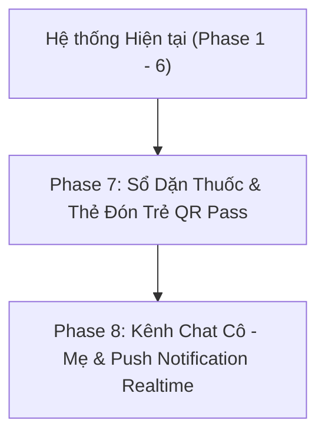

# 📋 Báo Cáo Review & Lộ Trình Đề Xuất Phát Triển Hệ Thống Mầm Non NVSOFT

---

## 🎯 I. Đánh Giá & Review Hệ Thống Hiện Tại

Hệ thống ERP Mầm Non NVSOFT hiện tại đã hoàn thiện trọn vẹn **6 Phase cốt lõi**:
1. 🔐 **Phân quyền & Xác thực (RBAC):** Ban Giám Hiệu, Giáo viên, Phụ huynh.
2. 🎒 **Quản lý Học sinh & Điểm danh:** Lọc điểm danh theo Lớp, 1-Click điểm danh.
3. 💳 **Tài chính & Thanh toán VietQR:** Tự động tạo mã QR chính xác số tiền & nội dung chuyển khoản.
4. 🥣 **Dinh dưỡng & Bếp ăn:** Thực đơn tuần, quản lý nhập kho thực phẩm & đối soát chi phí.
5. 🩺 **Sức khỏe & Sổ Bé Ngoan:** Chỉ số BMI chuẩn WHO, cảnh báo dị ứng, giấc ngủ & 5-star Sổ Bé Ngoan.
6. 📱 **Trải nghiệm PWA & Mobile:** Cài đặt PWA 1-click, thanh điều hướng Mobile Bottom Bar & xử lý tai thỏ (Safe Area).

---

## 💡 II. Đề Xuất 5 Phân Hệ Nâng Cấp Đáng Giá & Tiện Lợi Nhất

### 1️⃣ 🚍 Phân Hệ Đưa Đón Học Sinh Thông Minh (Smart Pickup & QR Gate Pass)
* **Thực trạng:** Điểm danh hiện tại dừng ở mức ghi nhận có mặt tại lớp.
* **Giải pháp bổ ích:**
  * **Thẻ Đón Trẻ Điện Tử (Digital Pickup Pass):** Cung cấp mã QR định danh cho Phụ huynh trên App. Khi người thân đến cổng trường đón bé, bảo vệ/cô giáo dùng điện thoại quét mã -> Hệ thống gửi thông báo ngay về máy bố mẹ: *"Bé Khang đã được Bà Nội đón lúc 16:45"*.
  * **Đăng ký Người đón hộ:** Phụ huynh có thể upload hình ảnh & CMND/CCCD người thân đăng ký đón hộ trực tiếp trên App.

---

### 2️⃣ 💬 Kênh Tương Tác Cô - Mẹ & Sổ Dặn Thuốc Điện Tử (Teacher-Parent Chat & Medicine Request)
* **Giải pháp bổ ích:**
  * **Sổ Dặn Thuốc Trực Tuyến:** Phụ huynh gửi dặn dò (*"Nhờ cô cho bé uống 1 gói Hapacol lúc 13:30 sau ăn trưa"*). Cô giáo sau khi cho uống bấm **Xác nhận**, phụ huynh nhận thông báo tức thì -> An tâm tuyệt đối.
  * **Trò chuyện Nội bộ (In-App Chat):** Kênh nhắn tin riêng tư giữa Phụ huynh và Cô giáo chủ nhiệm để trao đổi về tình hình sinh hoạt của con.

---

### 3️⃣ 📷 Phân Hệ Album Hoạt Động & Khoảnh Khắc Của Bé (Daily Class Moments)
* **Giải pháp bổ ích:**
  * Giáo viên chụp ảnh các hoạt động học tập, múa hát, vui chơi, sinh nhật của lớp và đăng lên **Album Ngày**.
  * Phụ huynh vào App xem ảnh con chất lượng cao, thả tim ❤️, bình luận và tải ảnh kỉ niệm về máy.

---

### 4️⃣ 🔔 Hệ Thống Thông Báo Đẩy PWA Realtime (Web Push Notifications)
* **Giải pháp bổ ích:**
  * Tích hợp Web Push Notifications (Firebase/FCM). Khi cô giáo điểm danh con vắng mặt, phát sổ Bé Ngoan hay có thông báo học phí mới, điện thoại phụ huynh sẽ nảy thông báo đẩy ngay trên màn hình khóa.

---

### 5️⃣ 📊 Phân Hệ Báo Cáo Tài Chính & Dự Báo Thu Chi Thông Minh (Smart Analytics & AI Insights)
* **Giải pháp bổ ích:**
  * Biểu đồ trực quan hóa doanh thu học phí vs chi phí nguyên vật liệu bếp ăn theo từng tháng/quý.
  * Tự động cảnh báo khi chi phí bếp ăn vượt định mức (Over-budget).
  * Tự động gửi thông báo nhắc đóng học phí tự động qua App/Zalo ZNS khi đến hạn.

---

## 🗓️ III. Đề Xuất Lộ Trình Triển Khai Tiếp Theo (Phase 7 & 8)

